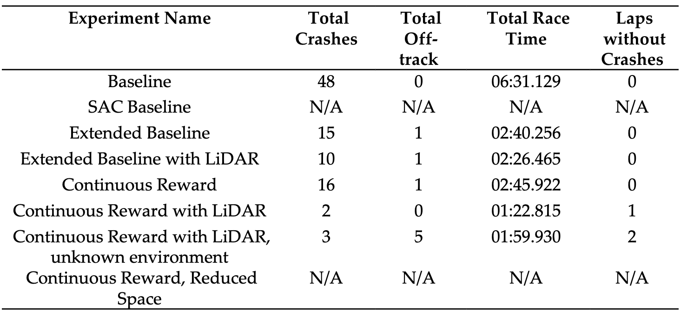

# Deep Reinforcement Learning for Autonomous Driving in AWS DeepRacer

AWS DeepRacer emerges as a powerful infrastructure for engineering and analyzing autonomous models, providing a robust foundation for addressing these complexities. This research investigates the feasibility of training end-to-end self-driving models focused on object avoidance using reinforcement learning on the AWS DeepRacer autonomous race car platform. Experimentation results of the best configuration demonstrate a significant improvement in obstacle avoidance performance when compared to the baseline configuration, with a 96% decrease in collision rate, all whilst taking 75% less time to complete a lap of the trialed circuit.

## Experiments

The following table describes the experiments performed in this research.

## Files

All the reward functions designed for this research are availble in the files described below and were used in the experiments described in the table above:

1. `baseline.py` - Baseline model, used for `Baseline` and `SAC Baseline` experiments;
2. `extended-baseline.py` - Extended baseline model, used for `Extended Baseline` and `Extended Baseline with LiDAR` experiments;
3. `continuous.py` - Continuous reward model used for `Continuous Reward`, `Continuous Reward with LiDAR`, `Continuous Reward with LiDAR, unknown environment`, `Continuous Reward, Reduced Space` experiments.
