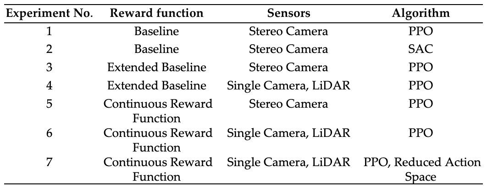
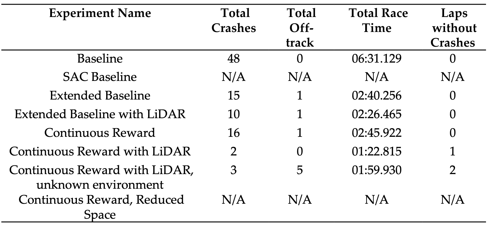
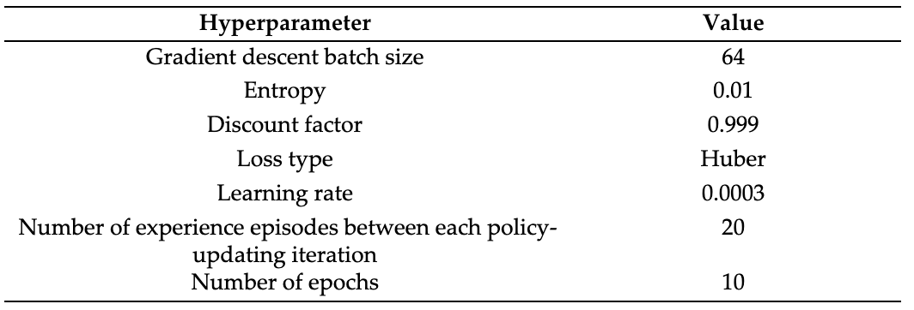
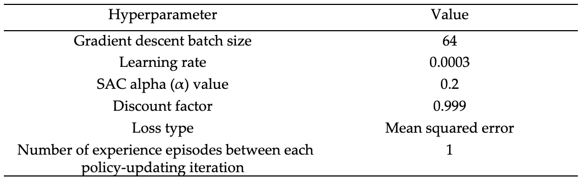
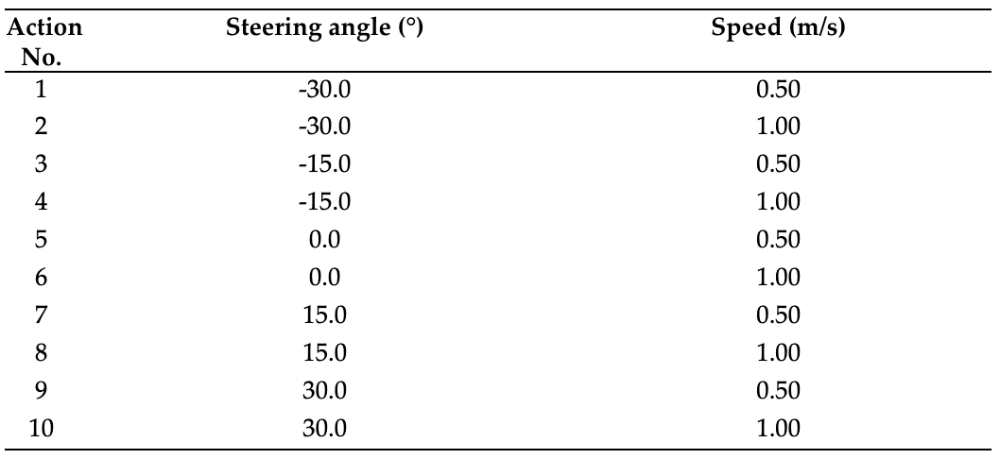

# Deep Reinforcement Learning for Autonomous Driving in AWS DeepRacer

AWS DeepRacer emerges as a powerful infrastructure for engineering and analyzing autonomous models, providing a robust foundation for addressing these complexities. This research investigates the feasibility of training end-to-end self-driving models focused on object avoidance using reinforcement learning on the AWS DeepRacer autonomous race car platform. Experimentation results of the best configuration demonstrate a significant improvement in obstacle avoidance performance when compared to the baseline configuration, with a 96% decrease in collision rate, all whilst taking 75% less time to complete a lap of the trialed circuit.

## Experiments

The following table describes the experiments performed in this research.

## Results

This table provides a summary of the results obtained in the experiments described above.

## Files

All the reward functions designed for this research are availble in the files described below and were used in the experiments described in the table above:

1. `baseline.py` - Baseline model, used for `Baseline` and `SAC Baseline` experiments;
2. `extended-baseline.py` - Extended baseline model, used for `Extended Baseline` and `Extended Baseline with LiDAR` experiments;
3. `continuous.py` - Continuous reward model used for `Continuous Reward`, `Continuous Reward with LiDAR`, `Continuous Reward with LiDAR, unknown environment`, `Continuous Reward, Reduced Space` experiments.

## Reproducutibility

All the experiments performed in this research were executed on the AWS DeepRacer platform, they are fully reproducible. To replicate the experiments described in the [Experiments](#experiments) section, follow the steps below:

1. Create AWS root account;
2. Go to `AWS DeepRacer` [console](https://console.aws.amazon.com/deepracer);
3. Follow the insrtuctions in the tutorial described [here](https://docs.aws.amazon.com/deepracer/latest/developerguide/deepracer-get-started-training-model.html) to launch the model training:
   1. [Specify the model name and environment](https://docs.aws.amazon.com/deepracer/latest/developerguide/deepracer-get-started-training-model.html#deepracer--create-model-step-one.title). Environment used in this research is `A to Z speedway` with `Clockwise` track direction. Three obstacles were randomly distributed across two lanes along the track at the beginning of each episode;
   2. [Choose a race type and training algorithm](https://docs.aws.amazon.com/deepracer/latest/developerguide/deepracer-get-started-training-model.html#deepracer--create-model-step-two). `Object avoidance` race type was selected for this research, algorithms used were `PPO` and `SAC` depending on the experiment, described in the [Experiments](#experiments) section;
   3. Define algorithm hyperparameters. `PPO` hyperparameters used in this research are described in the table below:
      
      `SAC` hyperparameters used in this research are described in the table below:
      
   4. [Define action space](https://docs.aws.amazon.com/deepracer/latest/developerguide/deepracer-get-started-training-model.html#deepracer--create-model-specify-action-space). `PPO` algorithm was used with discrete action space, `SAC` algorithm was used with continuous action space. Default continuous action space provided in the [AWS docs](https://docs.aws.amazon.com/deepracer/latest/developerguide/deepracer-get-started-training-model.html#deepracer--create-model-specify-action-space) was used. Discrete action space is defined in the table below:
      
   5. [Choose a virtual car](https://docs.aws.amazon.com/deepracer/latest/developerguide/deepracer-get-started-training-model.html#deepracer-create-model-step-four). Select the corresponding sensors based on the [Experiments](#experiments) section;
   6. Then in the [Customize your reward function](https://docs.aws.amazon.com/deepracer/latest/developerguide/deepracer-get-started-training-model.html#deepracer-create-model-step-five) step, copy and paste the reward function code from the [Files](#files) section described above;
   7. Select stop conditions. Training time was set to 3 hours for all the experiments;
4. Once the model is trained, go to `Evaluation` tab, select the model to evaluate, and follow the steps described [here](https://docs.aws.amazon.com/deepracer/latest/developerguide/deepracer-get-started-test-in-simulator.html):
   1. Choose a racing type. `Object avoidance` was selected for the evaluation;
   2. Choose a track. `A to Z speedway` with `Clockwise` track direction was selected for the evaluation during all the experiments except `Continuous Reward with LiDAR, unknown environment` where `Smile Speedway` with `Clockwise` track direction was selected. `A to Z speedway` had 3 obstacles with fixed position, placed at 25%, 50%, 75% of the track length. `Smile Speedway` had 4 obstacles with fixed position, placed at 20%, 40%, 60%, 80% of the track length.
   3. Choose a model. Select the model trained in the previous step. Each model was evaluated for 3 trials.
